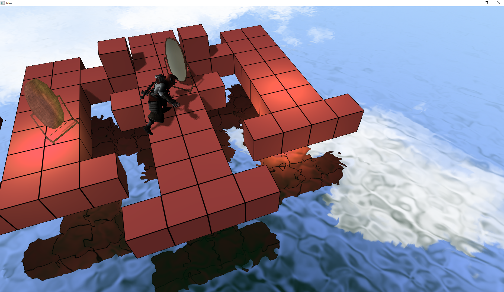

# Isles
A game engine for Windows, written in C/C++.

## Features
  - Sokoban puzzle mechanics
  - 3D Level Editor
  - D3D11 Renderer
  - Water rendering
  - Custom IMGUI API
  - Audio using FMOD
  - Input using native Windows API

## Build
Run `build.bat`
